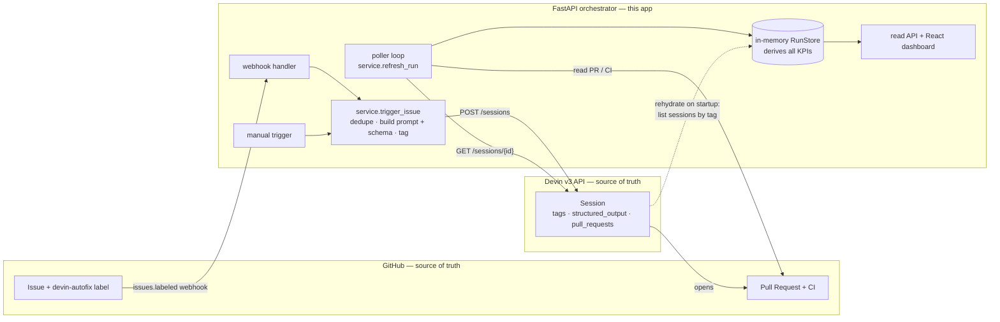
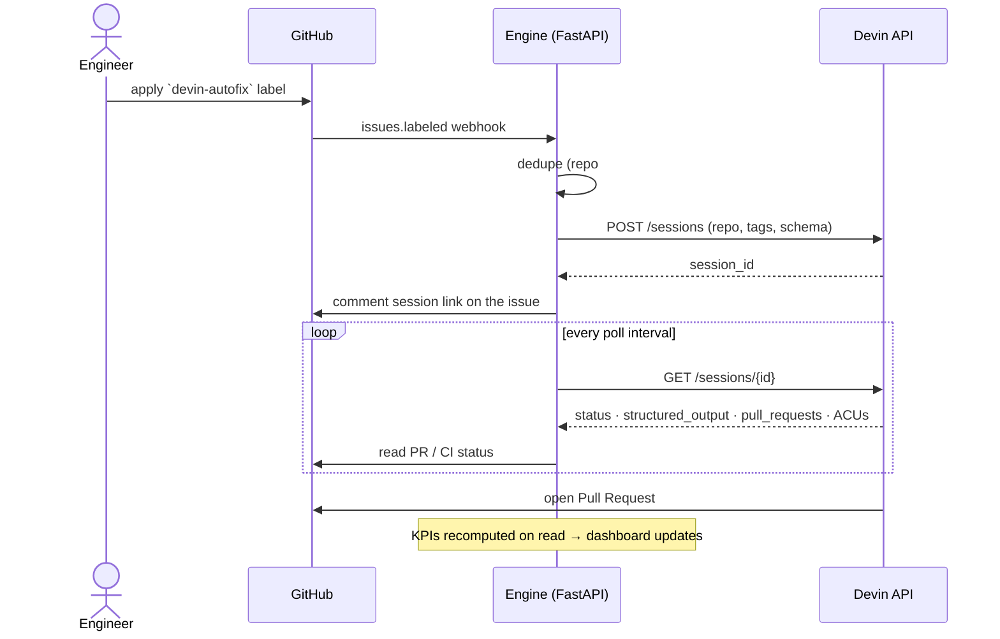

# Architecture

The Devin Autofix Engine is a thin orchestration + observability layer on top of two
systems that already hold all the durable state: **GitHub** (issues, labels, PRs, CI) and
the **Devin v3 API** (sessions, tags, structured output). The engine's job is to turn a
labeled issue into a managed Devin session and to project the combined state onto a
real-time dashboard.

## End-to-end flow



**Read it in one line:** an engineer labels an issue → a webhook starts a Devin
session → Devin opens a PR → a poller folds the session + PR state into an
in-memory store that the dashboard reads. There's no database; on restart the
store is rebuilt by listing Devin sessions by tag.

### What happens when you apply the label



## Design principles

1. **Near-stateless — no database.** The engine keeps only an in-memory cache of the runs
   it has triggered. GitHub and Devin are the source of truth. On restart the cache is
   rebuilt by listing Devin sessions tagged `devin-autofix` and re-joining GitHub PR/CI
   state (see [Rehydration](#rehydration)). Nothing is persisted or duplicated, so there
   are no migrations, no schema drift, and no stale-write bugs.
2. **Trigger-agnostic pipeline.** The webhook handler and the manual trigger both funnel
   into one function, `trigger_issue(...)`. Adding a new trigger (security scan, scheduled
   sweep, CI-failure auto-fix) is a new entry point, not a rewrite.
3. **Structured-output contract.** Every session is created with a JSON Schema so results
   come back machine-readable (`pr_url`, `confidence`, `risk_level`,
   `estimated_human_minutes`, `verification`, …). The dashboard reads these fields directly
   — it never scrapes session text.
4. **Idempotent triggering.** A run is keyed by `repo#issue`. Re-applying the label (or a
   duplicate webhook delivery) returns the existing run instead of spawning a second
   session.

## Component map

```
┌──────────────────────────────────────────────────────────────────┐
│ GitHub (source of truth)   issues · labels · PRs · CI checks     │
└─────────┬───────────────────────────────────────────┬────────────┘
          │ webhook: issues.labeled                     │ PR state / CI status
          ▼                                             ▲
┌──────────────────────────────────────────────────────────────────────┐
│ FastAPI orchestrator (this app)                                      │
│                                                                      │
│  webhook handler ─┐                                                  │
│                   ├─► service.trigger_issue ─► Devin: create session │
│  manual trigger ──┘        (dedupe, build prompt + schema, tag,      │
│                             comment session link on issue)           │
│                                                                      │
│  poller (async loop) ─► service.refresh_run ─► Devin: get session    │
│                              └─► GitHub: PR/CI status                │
│                                                                      │
│  in-memory RunStore  (keyed by repo#issue; derives all KPIs)         │
│                                                                      │
│  read API: /api/runs · /api/stats · /api/runs/.../messages           │
│  static:  serves the built React dashboard                           │
└─────────┬─────────────────────────────────────────────┬──────────────┘
          │ POST /v3/.../sessions                       │ GET /v3/.../sessions/{id}
          ▼                                             ▲
┌──────────────────────────────────────────────────────────────────┐
│ Devin v3 API (source of truth)                                   │
│   sessions · tags · structured_output · pull_requests · messages │
└──────────────────────────────────────────────────────────────────┘
```

### Backend modules (`backend/app/`)

| Module | Responsibility |
|---|---|
| `main.py` | FastAPI app: routes (health, runs, stats, messages, triggers, webhook), app lifespan (rehydrate on startup + launch the poller), and static serving of the built frontend. |
| `config.py` | `Settings` (pydantic-settings) loaded from env / `.env`. Tokens, repo, trigger label, poll interval, ACU cap. |
| `devin.py` | `DevinClient` — Devin v3 API wrapper: create session, get session, list sessions (by tag), get session messages. |
| `github.py` | `GithubClient` — GitHub REST helpers: get issue, comment on issue, read PR/CI status. |
| `service.py` | Orchestration: `trigger_issue` (dedupe → prompt → create session → tag → comment), `refresh_run` (pull session + PR/CI into a run), `rehydrate_from_devin` (rebuild store from tags). |
| `store.py` | `Run` dataclass + `RunStore` (thread-safe in-memory dict) + KPI aggregation (`stats()`). |
| `prompts.py` | The remediation prompt template + the structured-output JSON Schema. |
| `poller.py` | Async loop that periodically calls `refresh_run` for active runs and PRs not yet terminal. |
| `http.py` | Shared `httpx.AsyncClient` (one connection pool, closed on shutdown). |

### Frontend (`frontend/src/`)

| File | Responsibility |
|---|---|
| `App.tsx` | The dashboard: KPI cards, stat strip, active-sessions fleet, issue-type donut, runs table, and the detail drawer (Activity log + Result + raw JSON tabs). Polls the read API. |
| `api.ts` | Fetch wrappers for the read API. |
| `types.ts` | TypeScript types mirroring the backend `Run` shape. |
| `ui.tsx` | Presentational helpers: status badges, category colors, number/time formatters. |

## Request lifecycles

### Trigger (webhook or manual)

```
label applied ─► GitHub fires issues.labeled webhook ─► POST /api/webhook/github
  1. verify X-Hub-Signature-256 (skipped if no secret configured)
  2. parse body  (accepts BOTH application/json AND x-www-form-urlencoded)
  3. ignore unless event=issues, action=labeled, label==TRIGGER_LABEL
  4. service.trigger_issue(repo, issue, trigger_type="webhook", triggered_by=sender)
       a. dedupe: if a run with a session already exists for repo#issue, return it
       b. fetch issue (title, body, labels) from GitHub
       c. build prompt + attach structured-output JSON Schema
       d. POST /v3/.../sessions  with tags: devin-autofix, repo:<r>, issue:<n>, category:<c>
       e. store the Run; comment the session link on the issue
```

The manual path (`POST /api/trigger {"issue_number": N}` / dashboard button) skips steps 1–3
and calls the same `trigger_issue` with `trigger_type="manual"`. The drawer's **Trigger**
field (`webhook · by …` vs `manual · by dashboard`) reflects which path fired.

> **Why parse both content types:** GitHub's webhook default is
> `application/x-www-form-urlencoded` (the JSON arrives under a `payload` form field), not
> raw JSON. A JSON-only handler 500s on real deliveries, so `_parse_webhook_payload`
> accepts both.

### Refresh (poller)

```
every POLL_INTERVAL_SECONDS:
  for each run that is active OR has a non-terminal PR:
    GET /v3/.../sessions/{id}  ─► status, status_detail, structured_output, pull_requests, ACUs
    if a PR exists:  GitHub ─► CI status
    upsert into the store  (KPIs are recomputed on read)
```

### Activity log

The drawer's default tab streams the session's chronological messages from
`GET /api/runs/{owner}/{name}/{issue}/messages` → `DevinClient.get_session_messages`, polled
every few seconds while the session is active. The **Result** tab renders the structured
output once available.

## Rehydration

On startup (`main.lifespan`) the engine calls `rehydrate_from_devin()`:

1. List Devin sessions (`limit=100`) and keep those tagged `devin-autofix`.
2. Recover `issue:` / `repo:` / `category:` from each session's tags.
3. Best-effort re-fetch the issue title + label-derived category from GitHub.
4. Fully enrich each run (PR, CI, structured output, ACUs) via `refresh_run`.

This is what makes the "no database" claim real: kill the process and every run comes back
from Devin's own metadata.

## Data model

A `Run` (see `store.py`) is keyed by `repo#issue` and carries: trigger context
(`trigger_type`, `triggered_by`, `triggered_at`), Devin session fields (`session_id`,
`status`, `status_detail`, `acus_consumed`), results (`pr_url`, `pr_state`, `ci_status`,
`structured_output`), and derived properties (`is_active`, `needs_attention`,
`time_to_pr_seconds`, `estimated_human_minutes`). KPIs (success rate, merge rate, hours
saved, avg time-to-PR, category donut, needs-attention) are computed on demand in
`RunStore.stats()` — never stored, so they can't go stale.

## Trade-offs

- **In-memory store** means KPIs reset if the process restarts before rehydration completes,
  and it doesn't scale horizontally (one process owns the cache). For a single-tenant
  maintenance fleet this is the right amount of engineering; a multi-replica deployment would
  swap `RunStore` for Redis/Postgres behind the same interface.
- **Polling** (vs. Devin-side push) keeps the integration simple and resilient to missed
  events, at the cost of up-to-`POLL_INTERVAL_SECONDS` latency on status changes.
- **Webhook signature** is optional (skipped when `GITHUB_WEBHOOK_SECRET` is blank) to make
  local/tunnel demos friction-free; set the secret in any real deployment.
