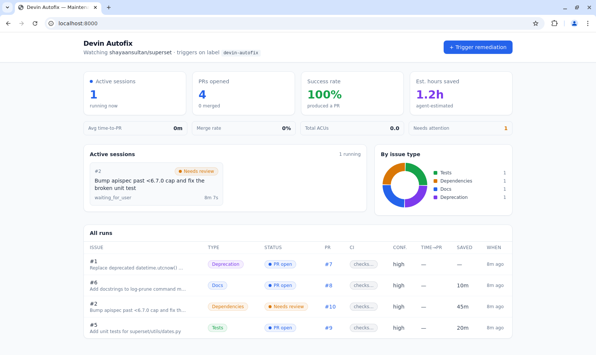

# Devin Autofix Engine — Autonomous Maintenance Fleet

An event-driven system that uses the [Devin v3 API](https://docs.devin.ai/api-reference/overview) to autonomously remediate repository issues (dependencies, deprecations, code quality, tests, docs) and track results on a real-time dashboard.

Label an issue `devin-autofix` → a Devin session spawns, fixes it, and opens a PR → the dashboard tracks the whole fleet live.



## How it works

```
Human labels issue "devin-autofix"
  → GitHub webhook → FastAPI orchestrator (dedupe, build prompt + schema)
  → POST /v3/.../sessions → comment session link on issue
  → Devin resolves the issue, opens a PR "Closes #N"
  → Background poller reads session status + PR/CI → dashboard updates live
```

Three decisions worth knowing up front (full rationale in **[ARCHITECTURE.md](ARCHITECTURE.md)**):

- **Near-stateless — no database.** Devin session tags + structured output + GitHub PR state are the source of truth; the engine rehydrates on restart by listing sessions tagged `devin-autofix`.
- **Structured-output contract.** Every session returns machine-readable JSON (`pr_url`, `risk_level`, `estimated_human_minutes`, `verification`, …) — the dashboard reads it directly, no scraping.
- **Trigger-agnostic.** Webhook and manual trigger feed one pipeline; adding security scans, scheduled sweeps, or CI-failure fixes is a new trigger, not a rewrite.

## Quick start

**Prerequisites:** Docker + Docker Compose · a [Devin service-user token](https://app.devin.ai/settings/api-keys) (`cog_…`, role needs **ManageOrgSessions**) · a GitHub token with `repo` scope.

```bash
git clone https://github.com/shayaansultan/devin-autofix-engine
cd devin-autofix-engine
cp .env.example .env     # fill in the 4 required values below
docker compose up --build
```

Open **http://localhost:8000**.

### Required `.env` values

| Variable | Description |
|---|---|
| `DEVIN_API_TOKEN` | Service-user token, starts with `cog_`. |
| `DEVIN_ORG_ID` | Your organization ID, starts with `org-`. |
| `GITHUB_TOKEN` | Token with `repo` scope (read issues, comment, read PR/CI). |
| `GITHUB_REPO` | `owner/repo` the engine watches (e.g. `shayaansultan/superset`). |

Optional knobs (`TRIGGER_LABEL`, `GITHUB_WEBHOOK_SECRET`, `NGROK_AUTHTOKEN`, `MAX_ACU_LIMIT`, `PLAYBOOK_ID`) are documented in [`.env.example`](.env.example).

### Trigger a remediation

- **Manual:** click **"+ Trigger remediation"** in the dashboard and enter an issue number (or `POST /api/trigger {"issue_number": N}`).
- **Live webhook (the real event-driven path):** see below.

### Live webhook trigger

1. Start with the tunnel: `docker compose --profile webhook up --build` (set `NGROK_AUTHTOKEN` first), then copy the public URL from **http://localhost:4040**.
2. In your repo: **Settings → Webhooks → Add webhook**
   - **Payload URL:** `https://<ngrok-url>/api/webhook/github`
   - **Content type:** `application/json` *(form-encoded also works)*
   - **Secret:** match `GITHUB_WEBHOOK_SECRET` (or leave both blank to skip verification)
   - **Events:** "Let me select individual events" → **Issues** only
3. Apply the `devin-autofix` label to a clean issue → a run appears with **Trigger: `webhook`**.

> Registering a webhook needs the `admin:repo_hook` permission, which the Devin GitHub App token intentionally lacks — add it once in the GitHub UI (above) or via a PAT.

<details>
<summary><b>Troubleshooting the webhook</b></summary>

| Symptom | Likely cause |
|---|---|
| Delivery `401` | `GITHUB_WEBHOOK_SECRET` in the UI doesn't match `.env` (or one is set, the other blank). |
| Delivery `404` | Wrong path — must end in `/api/webhook/github`; or the tunnel/backend is down. |
| `200` but no run appears | Label name ≠ `TRIGGER_LABEL`, or a run already exists for that issue (dedupe). |
| Run says `manual` | Created by the dashboard button, not the webhook. |

</details>

<details>
<summary><b>Run locally without Docker (uv + npm)</b></summary>

```bash
# 1. Build the frontend (the backend serves the built assets)
cd frontend && npm install && npm run build && cd ..

# 2. Run the backend (reads the .env in the repo root)
cd backend && uv sync && uv run uvicorn app.main:app --host 0.0.0.0 --port 8000
```

For the live webhook in local dev, run your own tunnel (`ngrok http 8000`) and use its URL above.

</details>

## What the dashboard shows

| Section | Description |
|---|---|
| **KPI cards** | Active sessions, PRs opened, success rate, est. hours saved |
| **Stat strip** | Avg time-to-PR, merge rate, total ACUs, ACUs/PR, est. cost (when a rate is set), needs-attention count |
| **Active sessions** | Live fleet view with status, elapsed time, deep-link to Devin |
| **Issue-type donut** | Category breakdown (security, deps, tests, docs, quality) |
| **Runs table** | Every run with status, PR link, CI check, confidence, hours saved |
| **Detail drawer** | Live **activity log** (the session's streamed messages) + a **Result** tab (structured output, key changes, verification) |

## API

| Endpoint | Method | Description |
|---|---|---|
| `/api/health` | GET | Config + connectivity check |
| `/api/runs` | GET | All tracked runs with enriched state |
| `/api/runs/{owner}/{name}/{issue}/messages` | GET | Live activity log (session messages) |
| `/api/stats` | GET | Aggregate KPIs |
| `/api/trigger` | POST | Manual trigger: `{"issue_number": N}` |
| `/api/webhook/github` | POST | GitHub webhook receiver (`issues.labeled`) |

## Structured output contract

Every session is created with this JSON Schema, so results come back machine-readable:

```json
{
  "pr_url": "https://github.com/owner/repo/pull/7",
  "summary": "Replaced 28 deprecated utcnow() calls...",
  "issue_type": "deprecation",
  "files_changed": 6,
  "key_changes": ["Replaced datetime.utcnow() with..."],
  "tests_passed": true,
  "verification": "ran pytest, 53 passed; pre-commit clean",
  "risk_level": "low",
  "confidence": "high",
  "estimated_human_minutes": 45,
  "blockers": ""
}
```

## Demo mode & illustrative cost

> This `demo` branch enables an **illustrative cost view**. It is intentionally
> separate from `main`/`initial`, which stays strictly API-driven.

The dashboard tracks compute cost in **ACUs** (Agent Compute Units). On
**Enterprise** orgs the engine reads real per-session ACUs straight from the
Devin API and the cost view is exact. **Self-serve** accounts (Free/Pro/Max/Teams)
do *not* expose per-session ACUs through the API — the field is always `0`, since
self-serve usage is metered as included quota + dollar credits at *Settings →
Plans*, not as per-session ACUs (per [Devin's billing docs](https://docs.devin.ai/admin/billing)).

So that the cost story is demoable on a self-serve account, `DEMO_MODE=true`
fills in an **estimate** when the API reports `0` ACUs:

```
estimated_ACUs = active_session_minutes × ACU_PER_MINUTE      # ~1 ACU / 15 min
estimated_USD  = estimated_ACUs × ACU_USD_RATE                # e.g. $2.25 / ACU
```

`ACU_PER_MINUTE` defaults to `0.0667` — Cognition's published rule of thumb that
**~15 minutes of active Devin work ≈ 1 ACU** ([TechCrunch](https://techcrunch.com/2025/04/03/devin-the-viral-coding-ai-agent-gets-a-new-pay-as-you-go-plan/)).
`ACU_USD_RATE=2.25` is the legacy public per-ACU price. Every estimated figure is
labeled **"(est.)"** in the UI, and real ACUs always take precedence — so this is
a **no-op on Enterprise**, where true numbers show automatically. Set
`DEMO_MODE=false` to show only API-reported ACUs.

| Var | Default | Meaning |
|---|---|---|
| `DEMO_MODE` | `false` | Estimate ACUs from runtime when the API reports 0 |
| `ACU_PER_MINUTE` | `0.0667` | ACUs per active minute (~1 ACU / 15 min) |
| `ACU_USD_RATE` | `0` | $/ACU for the cost view (`0` = ACUs only) |

## Demo repository

Demonstrated against [shayaansultan/superset](https://github.com/shayaansultan/superset) (a fork of Apache Superset) with issues spanning security (CVE bump), deprecation, dependencies, tests, docs, and code quality — each triggered through the engine, producing parallel Devin sessions and PRs tracked on the dashboard.

For design rationale, module map, request lifecycles, and trade-offs, see **[ARCHITECTURE.md](ARCHITECTURE.md)**.
